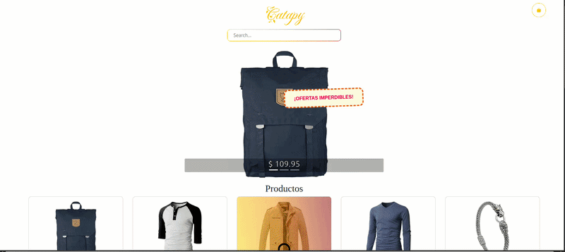

# Catapy 🛒

---

## Demo

## 🔹 Descripción

**Catapy** es un **prototipo de tienda online** desarrollado con React y Vite.  
Permite experimentar con un **carrito de compras completo**, incluyendo:

- Visualización de productos
- Agregar y eliminar productos del carrito
- Guardado del carrito para continuar la compra
- Sistema de envío de pedidos a **WhatsApp**, donde el usuario puede poner su número de prueba y enviar **solo los pedidos**
- Todo **100% gratuito**, ideal para pruebas y demostraciones

> ⚠️ Este proyecto es un prototipo, no está conectado a pagos reales ni a envíos.

---

## 🔹 Funcionalidades principales

1. **Catálogo de productos**
   - Muestra productos con nombre, precio e imagen.

2. **Carrito de compras**
   - Agregar productos con cantidad.
   - Calcular subtotal y total automáticamente.
   - Guardar carrito para continuar más tarde.

3. **WhatsApp para pedidos**
   - Permite enviar el pedido completo a un número de WhatsApp de prueba.
   - Solo envía la información de los productos seleccionados, cantidades y total.

4. **Interfaz responsiva**
   - Se adapta a escritorio y móvil usando React y CSS.

---

## 🔹 Demo en línea

Puedes probar el prototipo directamente desde Netlify:

[👉 Ver Catapy en Netlify](https://catapy.netlify.app/)

---

## 🔹 Repositorio

El código completo del proyecto está disponible en GitHub:

[👉 Catapy en GitHub](https://github.com/XRukazuX/E-Commerce)

---

## 🔹 Tecnologías utilizadas

- **React**
- **Vite**
- **React Icons** para iconos
- **React Router** para navegación
- **LocalStorage** para guardar el carrito
- **WhatsApp API** para enviar pedidos
